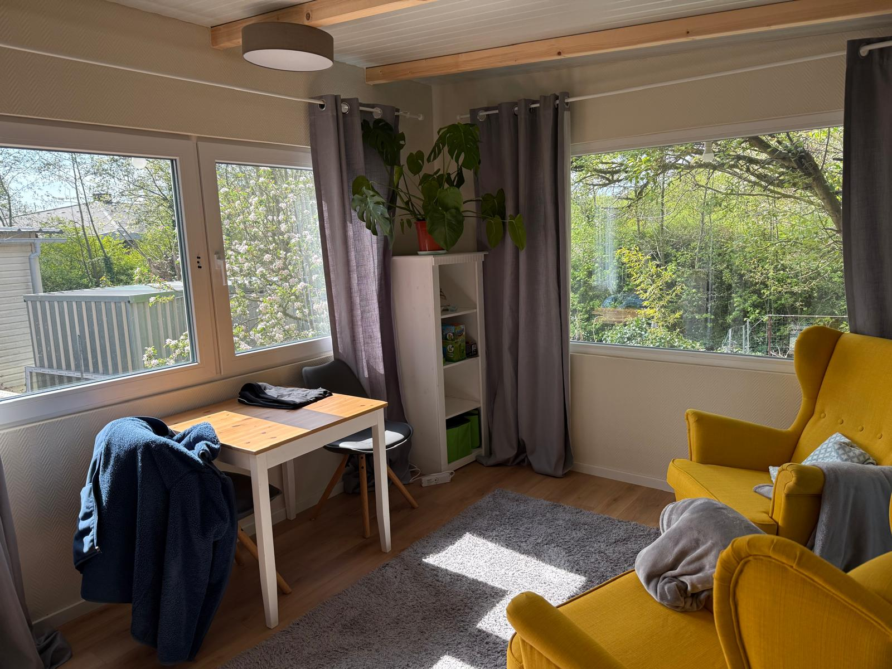
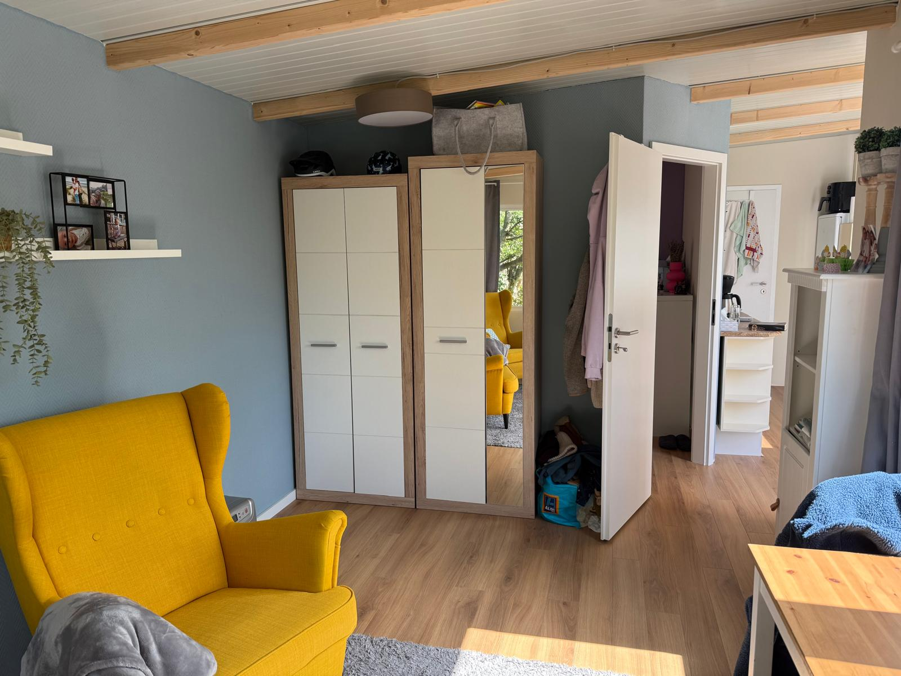
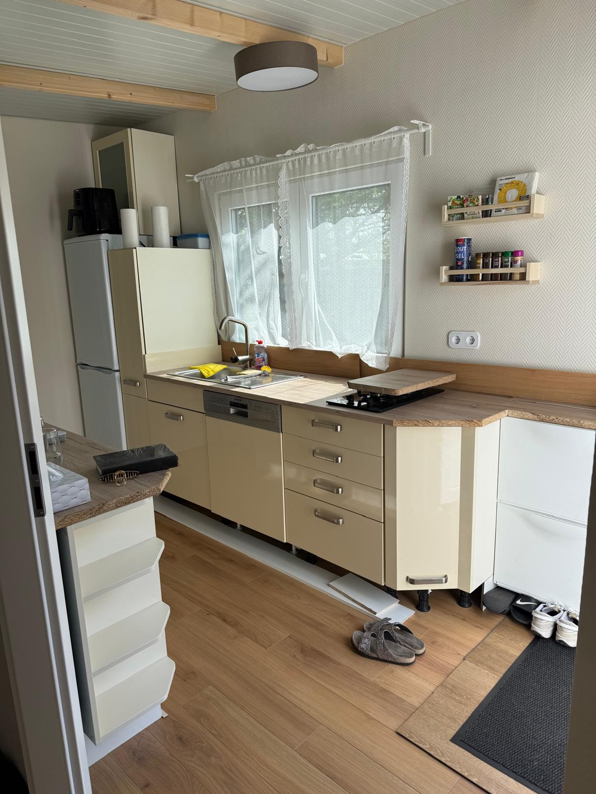
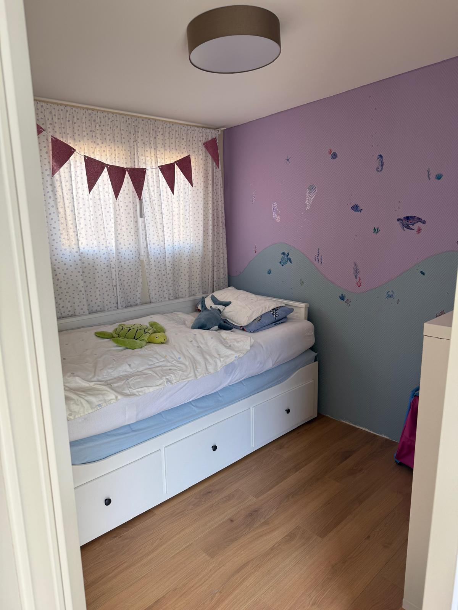
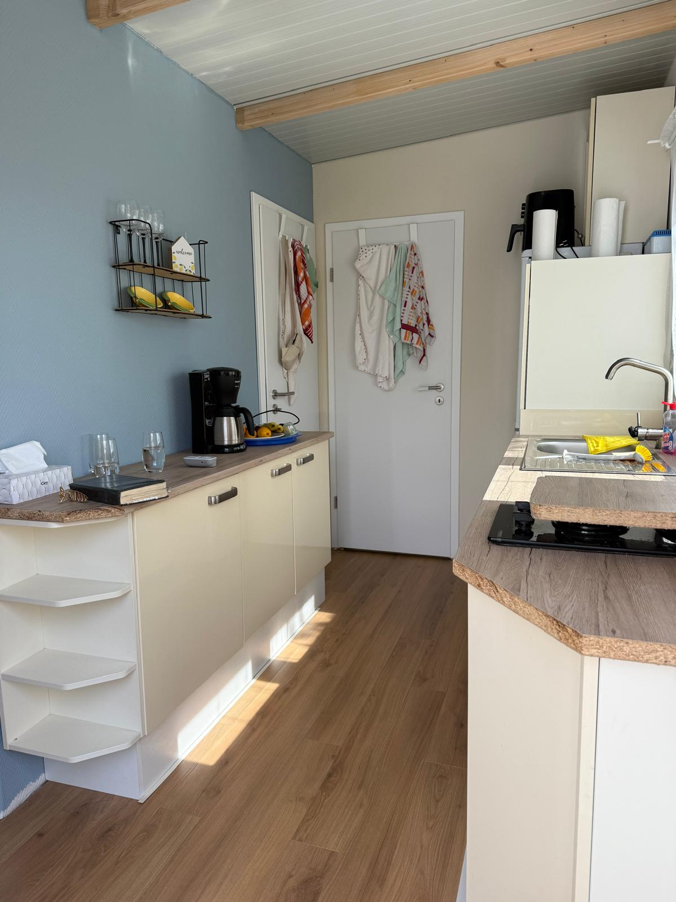
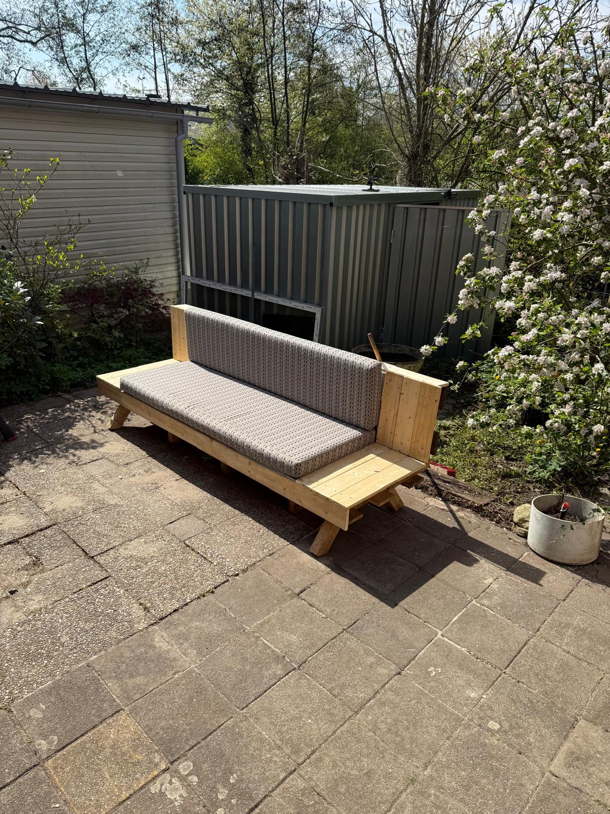
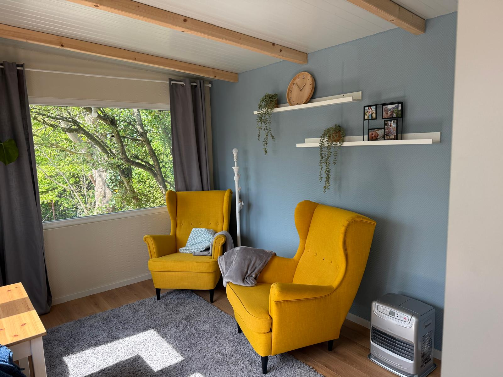
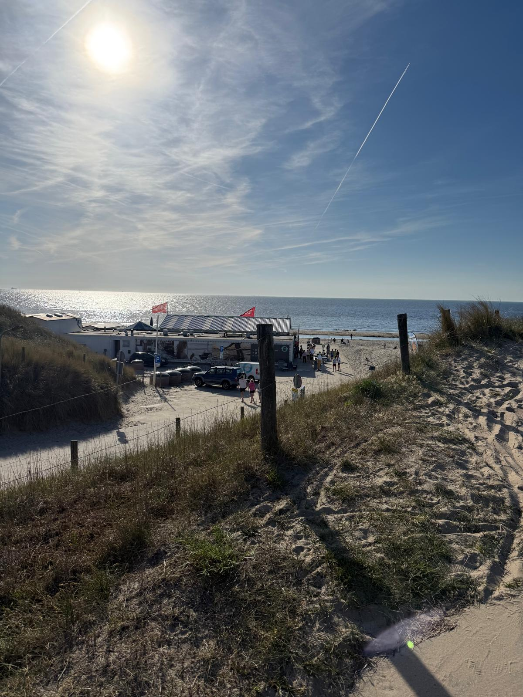

# 🌿 Willkommen in unserer liebevoll eingerichteten Ferienwohnung in Holland

## 🧘‍♀️ Erholung, Natur & Erlebnis – alles an einem Ort

Unsere selbst gebaute Ferienwohnung in wunderschöner Lage in Holland bietet Ihnen die perfekte Kombination aus **Komfort**, **Natur**, **Kultur** und **Familienfreundlichkeit**.  
Ideal für **Paare**, **Familien** oder **Individualreisende**, die dem Alltag entfliehen möchten.

---

## 🏡 Die Ferienwohnung – mit Liebe zum Detail

Die ca. **40 m² große Wohnung** ist hochwertig und gemütlich eingerichtet und bietet Platz für bis zu **4 Personen**:

- 🛏 **Elternschlafzimmer** mit Doppelbett  
- 🛌 **Kinderzimmer** mit zwei Einzelbetten  
- 🛋 **Heller Wohn- und Essbereich** mit viel Platz zum Entspannen  
- 🍽 **Moderne Küche** mit allem, was das Herz begehrt:
  - Großer Kühlschrank
  - Gasherd & Induktionskochfeld
  - Backofen & Spülmaschine
  - Kaffeemaschine, Töpfe, Pfannen, Geschirr u.v.m.
- 🚿 **Badezimmer** mit Dusche und WC  
- 🧺 **Waschmaschine** zur freien Nutzung  
- 🌳 **Gemütlicher Garten** mit Sitzplatz, Grillmöglichkeit und Lagerfeuerstelle  

---

## 🌊 Die Umgebung – Natur, Meer & Abenteuer

### 🏖 Strand & Meer  
Nur wenige Minuten mit dem Fahrrad entfernt:  
**Ein wunderschöner Sandstrand**, ideal für Familien und alle, die **Weite und frische Meeresluft** genießen möchten.

### 🌿 Nationalpark mit Wildpferden und Büffeln  
Ganz in der Nähe liegt ein beeindruckender Naturpark –  
**Wildpferde und Büffel** leben hier frei in der Landschaft. Ein Highlight für Naturliebhaber!

### 🚴 Traumhafte Radwege  
Entdecken Sie die Region auf dem Rad:  
- Idyllische Fahrradstrecken durch die Natur  
- Fahrradfähren über Flüsse  
- Tierbeobachtungen unterwegs – z. B. Störche, Wasservögel, Rehe  

---

## 👨‍👩‍👧‍👦 Familienfreundlich – Spiel, Spaß & Tiere

Für Kinder gibt es zahlreiche **Spielplätze** und mehrere **kostenfreie kleine Zoos** mit:
- 🐐 Ziegen zum Streicheln  
- 🦚 Pfauen, 🦔 Stachelschweine – und sogar 🐊 Krokodile!

---

## 🍽 Kulinarisches & Kultur

### 🛍 Europas größter überdachter Bazaar  
**Fußläufig erreichbar** – ein farbenfrohes Erlebnis mit:
- Orientalischer Kleidung & Gewürzen  
- Türkischen Spezialitäten: Baklava, Antipasti, Oliven u.v.m.

### 🍦 Leckere Eiscafés & Strandbars  
In der Umgebung laden zahlreiche Eiscafés zum Genießen ein.  
Am **Nordpier** erwarten Sie:
- Traumhafte Sonnenuntergänge  
- Cocktails an der Strandbar  
- **Meerblick pur**

---

## 🚉 Perfekte Anbindung

- Bahnhof direkt in der Nähe – **Amsterdam in ca. 30 Minuten erreichbar**
- Flughafen gut angebunden  
- Supermärkte und die Stadt **Beverwijk** befinden sich in direkter Umgebung

---

## ✨ Interesse geweckt?

Wir freuen uns, **Sie bald als unsere Gäste begrüßen** zu dürfen!  
📩 Kontaktieren Sie uns gerne für weitere Informationen, Verfügbarkeiten und Buchungen.

---
## 📸 Bildergalerie

Hier ein paar Eindrücke unserer Ferienwohnung und der Umgebung:

